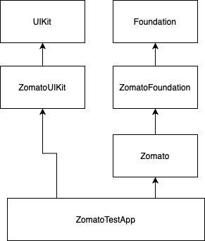

# Zomato

Simple demo of using Zomato API to query for restaurants to list in iOS app.

## How to use:

* xCode 12.2
* swift package manager is used for local and remote dependencies
* In AppDelegate will need to provide a Zomato API key
* Run app normally in xCode
* Inside folder DocumentationResources there is 2 gifs illustrating the app.

  

## Architecture:

App distributed in different layers.

### ZomatoFoundation

* Zomato utils for Foundation (network, binding, database)

### ZomatoUIKit

* Zomato utils for UIKit (mostly uikit extensions)

### Zomato
* Uses:
  * Service for network interactions
  * Repository for database interactions
  * Manager to combine service and repository interactions
* Makes Zomato API calls
* Saves data into a Sqlite Database
* Provides collections with pagination, sorting and filtering

### ZomatoTestApp

* UIKit app, because I believe SwiftUI needs some maturation to be used in a production app
* UI is made using auto layout with code
* Coordinator for organising flow logic between view controllers
* MVVM is used for the views and view controllers
  * Binding is done using a self made code inside ZomatoUIKit
* Cell configurator is used to configure collection view cells
* Dependencies are injected via constructor
* Dark theme aware

  
## Other Choices
* Zomato API is very inconsistent, because of that the network objects are parsed manually 
* Zomato API limits the search results to 100, but in the network response the limit is much higher and if we request another page beyond that we get no results. To avoid this the network layer will limit the results to 100 replacing the value if its bigger than 100.
* Zomato API doesn't support filter by cost, so the filter is implemented in the app side using the "price_range" attribute
* The app app in general makes use of protocols, making almost every component available to unit testing isolated. 

## Target

* iOS 12.0 is used as the minimum deployment target but could had chosen iOS 13 according to Apple.
  * 81% iOS 14
  * 17% iOS 13
  * 2% Earlier

https://developer.apple.com/support/app-store/

  

## Roadmap

- [ ] Filter screen needs some adjustments in bigger screens
- [ ] Unit tests
- [ ] Accessibility
- [ ] Analytics for page views and click events
- [ ] Error handling
- [ ] Better UX/UI
- [ ] Make Database use a protocol for easier testing and more easly replacable if needed
- [ ] Make RestaurantsCollection use a protocol to be generic and reused in other Zomato queries
- [ ] Better Log system
- [ ] [Firebase Crashlytics](https://firebase.google.com/products/crashlytics?gclid=EAIaIQobChMIwcv1_7qe7gIVG-3tCh2kNg9tEAAYASAAEgK3GvD_BwE)
- [ ] [SwiftLint](https://github.com/realm/SwiftLint)
- [ ] [SwiftGen](https://github.com/SwiftGen/SwiftGen)
- [ ] Replace binding library with something more sophisticated like Combine/RxSwift/ReactiveCocoa
- [ ] Build pipeline

  

## Dependencies

[Kingfisher](https://github.com/onevcat/Kingfisher), for downloading and caching images

  
## Other  
  
  

## License

All code in this repo is available under the MIT license.
